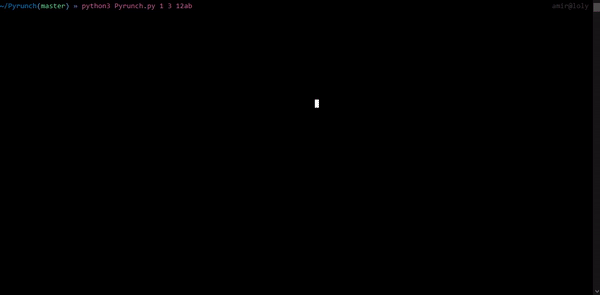

# Pyrunch
Python script for crunch

It is not as fast as the orginal crunch which is written in C but it is definitely faster than https://github.com/derv82/werdy/blob/master/crunch.py .
I will add multiprocessing in future.

    Usage: pyrunch.py <min> <max> <characters> <options>
           or
           pyrunch.py --mask <mask> <options>
    Options:
       -o         Set a Name or Directory for Output File (use -o - for piping the output to aircrack-ng, etc...)
       -m         Memory Friendly mode(slightly slower) [default: off]
       -s suffix  Add a Suffix to Passwords
       -p prefix  Add a Prefix to Passwords
       --hash     Hash Passwords With Given Algorithm:
                    md5, sha1, sha224, sha256, sha384, sha512, blake2b, blake2s,
                    sha3_224, sha3_256, sha3_384, sha3_512.
       --mask     Insted of Max and Min Length You Can Use Mask:
                    @: Alphabet_lower
                    ,: Alphabet_upper
                    $: Special_chars
                    %: Digits
       --gui      Lunch Gui Mode
       -h         Print This Help Message
               

